# Variables and Scalar types
In Python, variables are used to store data and give them a name that can be referenced later in the code.

```mermaid
flowchart LR
	D[Data types] --> N[Numbers]
	D --> Seq[Sequences]
	D --> Set[Set]
	D --> M[Mappings]
	D --> None
	N --> I[Intergral]
	I --> int
	I --> bool
	N --> float
	N --> Complex
	Seq -->|Mutable| list
	Seq -->|Mutable| Byte-Array
	Seq -->|Immutable| String
	Seq -->|Immutable| Tuple
	Seq -->|Immutable| Bytes
	Set -->|Mutable| Set
	Set -->|Immutable| Frozen-Set
	M --> dict
```



## Variables

Python has several scalar types and collection types for storing different kinds of data. 

Here's an overview of the commonly used variable types in Python:

```python
var = 1
```

normally you do not need to add a type for a variable but from python 3.5 you can add type to a variable like

```python
# variable_name: type = value
var: int = 1
```

The data type for the Python variable is automatically detected when you assign it.

### Scalar types:

#### Int

It holds the integer numbers and represents integer numbers, e.g., 1, -5, 1000.

```python
# Integers
num = 10
num = int("10") # called integer constructor
```
#### Float

It holds the numbers which have a floating-point and represents floating-point numbers (real numbers), e.g., 3.14, -2.5, 0.0.

```python
# Float
num = 10.0
num = float("10.0") # called float constructor
>>> num = 5e35000.0
```

#### Complex

```python
# Complex
>>> comp = 1 + 2j            # 1+2j
>>> comp = complex(1, +2)    # 1+2j
```

#### Boolean

It is a True or False value.
```python
# Boolean
flag = True
flag = False
>>> bool(10) # any value rather than zero is true
True
>>> bool("test")
True
>>> bool(0)
False
>>> bool("\")
False
```

#### None

It is a placeholder for the empty value (Null)

```python
# None value for empty
num = None
flag = None
```

### Collection types

#### Strings

It is a sequence of Unicode characters, and it is immutable, so you can't edit the string once you constructed it.

```python
# Strings
>>> string = "Test string"
>>> print(string) 
Test string
>>> string = str(500)
>>> print(string)
"500"
```
#### String Escape sequence

It is the way you can add special characters to a string, you can get more information on [python docs](https://docs.python.org/2.0/ref/strings.html).

Special characters preceded by a backslash represent characters that cannot be typed directly, such as newline \n, tab \t, or backslash \ .

```python
>>> string = "Test \\ in the string with a \n new line"
>>> print(string)
Test \ in the string with a
new line
```

#### Row strings

To stop Python from handling the special characters you can use a row string which are strings prefixed with "r" or "R" to treat backslashes as literal characters instead of escape characters.
like this:

```python
>>> path = r"C:\Users\Amr\Documents\Spells"
>>> print(path)
C:\Users\Amr\Documents\Spells
```

#### Bytes

It is a sequence of bytes (Row binary data), fixed-width single-byte encoding, used for working with binary data or encoding text.

```python
>>> data = b'test data'
>>> data[0]
116
>>> data.split()
[b'test', b'data']
```

#### List
It is a sequence of objects which can be the same type or in different types and it is mutable, so you can edit the list of elements, in other words, they are an ordered collection of items enclosed in square brackets ([]), separated by commas.
```python
>>> a = ["apple", "orange", "pear"] 
# the same of
>>> a = list("apple", "orange", "pear")
>>> a[1]
'orange'
>>> a = ["apple", 5 , "pear"]
>>> a[1]
5
# you can make an empty list by
>>> a = []
>>> a.append("apple")
```

#### Dict

It is a fundamental data structure in Python, which depends on mapping keys to values, this is why it is also known as maps or associative arrays, in other words, they are a collection of key-value pairs enclosed in curly braces ({}) where each value is accessed by a unique key.

```python
>>> theDict = {'first':1, 'sec':"amr"}
>>> theDict['first']
1
>>> theDict['first'] = "The first"
>>> theDict['first']
'The first'
# adding to the dict, by assigning to none existing key
>>> theDict['third'] = "test third"
>>> theDict['third']
'test third'
```

#### Range

It is a sequence representing an arithmetic progression of integers that represents an immutable sequence of numbers, usually used for looping a specific number of times.

```python
>>> range(5)
range(0, 5)
>>> for i in range(5): 
...    print(I)
...
0
1
2
3
4
>>> list(range(0, 10, 2))
[0, 2, 4, 6, 8]
```

#### Tuple

Immutable sequences of arbitrary objects that represent an immutable ordered collection of items enclosed in parentheses (()), separated by commas.

```python
>>> t = ("Name", 12, 73.02)
>>> t("Name", 12, 73.02)
>>> t[0]
'Name'
>>> len(t)
3
>>> t + ('Amr')
('Name', 12, 73.02, 'Amr')
# tuple packing and unpacking
>>> p = 1, 2, 3, 4, 5
(1, 2, 3, 4, 5) 
>>> a, b, c, d, e = p
>>> d
4
# Swapping
>>> a = 10
>>> b = 20
>>> a, b = b, a
>>> a
20
```

#### Set

An unordered collection of unique immutable elements that represents an unordered collection of unique items enclosed in curly braces ({}), where duplicates are automatically removed.

```python
>>> st = {1, 2, 3, 4, 5}
>>> st{4, 5, 3, 1, 2}
>>> list = [1, 2, 2, 2, 3]
>>> st = set(list)
>>> st{2, 1, 3}
>>> st.add(5)
>>> st{2, 1, 5, 3}
>>> st.add(5)
>>> st{2, 1, 5, 3}
```

### Protocols

Python protocols refer to a set of methods or behaviors that an object can implement to support specific functionality. Protocols are not distinct types but rather set of rules or interfaces that define how an object should behave. Examples of protocols in Python include the iterable protocol, context manager protocol, or comparison protocol.

| Protocol | Implementing collections | 
|:---------|:-------------------------|
| Container | bytes, str, range, list, tuple, dict, set |
| Sized | bytes, str, range, list, tuple, dict, set |
| Iterable | bytes, str, range, list, tuple, dict, set |
| Sequence | bytes, str, range, list, tuple |
| Mutable | list, dict, set |

It's worth noting that Python is a dynamically typed language, which means you don't need to explicitly declare the type of a variable. The type is inferred at runtime based on the assigned value.

**So now you can start with Python Operators and control flow.**