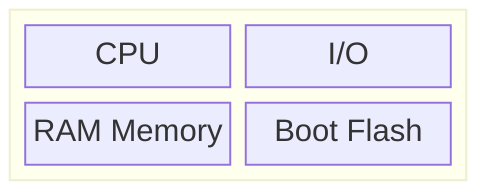

The Bootloader role is in initial stages on booting up the machine, in order for software to run the processor needs to know:
- Where the software is located, 
- How it can access the location, 
- Where the stack is located.

When the CPU powered-up the **Program Counter Register** in the CPU is set to the default value **the Reset Vector**

> **Program Counter** is a register which is hold the address of the instruction that is next to be run.

> **Reset Vector** is a pointer to an address that contains the first instruction to be executes from the firmware.

The software starting at the **Reset vector**, known as the Boot-loader**, which takes care of providing the processor all the needed information such as:
- Startup software location.
- How to access it.
- Where is the stack is located.

> The operation of Boot-loader is system architecture dependent.

## For Microcontroller

In case of Microcontroller all Software (bootloader + device tree + OS + root file system) is stored in the persistent storage (boot flash) which is embedded in the microcontroller.

The CPU reset vector is located in the **boot flash**, and **RAM** memory is embedded in the microcontroller and is used for data, **stack** and **heap** only.

## For SoC

In case of System on Chip system the bootloader and the Reset vector are stored into the boot flash, but the rest of the Software (Device tree + OS + root file system) is stored in **mass memory** and loaded to the RAM memory by the bootloader.

So the RAM memory will store the rest of the software plus data, stack and heap.

## In Action
### Before power up
The boot flash memory is preloaded with the bootloader, and the mass memory flash is preloaded with rest of software (Device Tree, Operating System, System programs, Application).

The boot flash is preloaded with the bootloader
- CPU reset vector at 0x0000_0000
- first bootloader instruction at 0x0000_0FFF
- Last bootloader instruction at 0x0000_AFFF

The mass memory flash is preloaded with:
- Device tree (DT)
- Operating systems (OS)
- System programs (SP)
- Application.

### During power up
The CPU starts executing software from the reset vector by jumping to the first instruction of the bootloader, and run the bootloader software from the boot flash memory.

The CPU starts executing software from the reset vector:
- it jumps to the first instruction of the bootloader.
- it runs the bootloader software from flash memory.

### During the Bootstrap process
The CPU executes the bootloader software which initialises the CPU RAM memory controller, then set up the CPU registers for mapping stack and heap to RAM memory, then copies the device tree, operating system, system programs, and applications to RAM memory.

- Initializes the CPU RAM memory controller.
- Sets up the CPU registers for mapping stack and heap to RAM memory.
- Copies device tree, operating system, system programs, and application to RAM memory.

### End of Bootstrap process

The bootloader jumps to the first instruction of the operating system.
The CPU now executes the operating system software, which is responsible for:
- setting up the execution environment for the application.
- starting application execution.