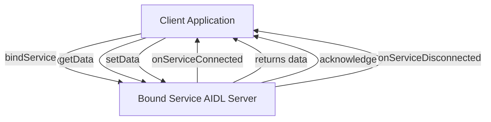
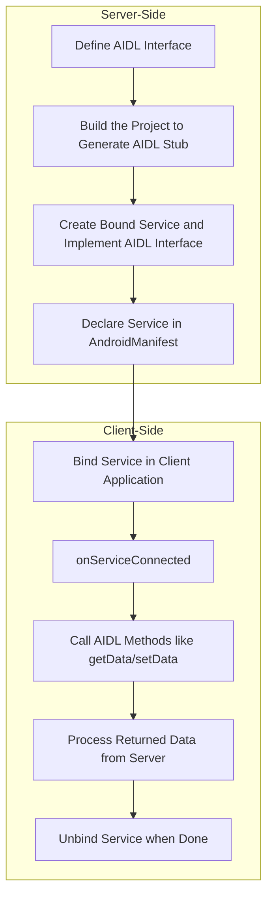

Android Interface Definition Language
IDL in general is a language to  facilitates communication between unknown Object or Processes

In Android each application runs in its own processes, an application can not directly access another application memory space. (Application sandboxing)

So an IPC (inter-process communication protocol) is needed to allow the cross application communication in Android.

AIDL is lightweight implementation of IPC using a syntax like Java and Kotlin


## Create AIDL
### Server:
#### 1. **Define the AIDL Interface:**
- Create a new `.aidl` file to define the interface.
- In your Android project, under `src/main`, create a directory called `aidl` (if not already present) at the same level as the `java` directory.
- Create a package structure inside the `aidl` folder that matches your app's package name (e.g., `com.example.myapp`).
- Right-click on this folder and select `New > AIDL > AIDL File`. Give the file a name (e.g., `IMyService.aidl`).
- Define your methods in the `.aidl` file. It should look something like this:
``` java
// IMyService.aidl
package com.example.myapp;

interface IMyService {
    String getData(int id);
    void setData(int id, String data);
}
```
#### 2. **Build the Project:**
- When you build the project, Android Studio will automatically generate a Java interface (in the `gen` folder) from the `.aidl` file. The generated code contains the required `Stub` and `Proxy` classes for your service.

#### 3. **Create the Bound Service:**
- Now, create a service that implements the generated interface. This service will run in the background and handle requests from clients (like Activities or other services).
``` java
public class MyService extends Service {

    // Implementation of the AIDL interface
    private final IMyService.Stub binder = new IMyService.Stub() {
        @Override
        public String getData(int id) throws RemoteException {
            return "Data for ID: " + id;
        }

        @Override
        public void setData(int id, String data) throws RemoteException {
            // Logic to set the data
        }
    };

    @Override
    public IBinder onBind(Intent intent) {
        return binder;
    }
}
```

#### 4. **Declare the Service in the Manifest:**
- You need to declare the service in your `AndroidManifest.xml` so it can be used:
``` java
<service
    android:name=".MyService"
    android:enabled="true"
    android:exported="true">
    <intent-filter>
        <action android:name="com.example.myapp.IMyService" />
    </intent-filter>
</service>
```



### Client:
#### **Bind to the Service in the Client:**
To bind to the AIDL service in a client (an Activity or another service), use the `bindService()` method.
The `ServiceConnection` is used to manage the connection to the service:
``` java
private IMyService myService = null;
private ServiceConnection serviceConnection = new ServiceConnection() {
    @Override
    public void onServiceConnected(ComponentName name, IBinder service) {
        myService = IMyService.Stub.asInterface(service);
    }

    @Override
    public void onServiceDisconnected(ComponentName name) {
        myService = null;
    }
};

private void bindToService() {
    Intent intent = new Intent();
    intent.setAction("com.example.myapp.IMyService");
    intent.setPackage("com.example.myapp");
    bindService(intent, serviceConnection, Context.BIND_AUTO_CREATE);
}
```

#### **Make Remote Calls:**
Once the connection is established, you can invoke methods on the service from the client:
``` java
if (myService != null) {
    try {
        String result = myService.getData(1);
        myService.setData(1, "Updated Data");
    } catch (RemoteException e) {
        e.printStackTrace();
    }
}
```

### Unbind the Service:
Unbind the service when the client is no longer active, typically in the `onDestroy()` method of the activity:

``` java
@Override
protected void onDestroy() {
    super.onDestroy();
    unbindService(serviceConnection);
}
```
## Implementation
AIDL uses the bound services to make a server client connection.





> - **Data Types**: AIDL supports basic data types (like `int`, `String`), `List`, `Map`, and custom `Parcelable` objects.
> - **Threading**: AIDL methods run on the service's binder thread. If you do heavy processing, move the logic to another thread to avoid blocking the main thread.
> - **Security**: Always consider security when using AIDL, especially when exporting services to other apps. You can use permission checks in your service.