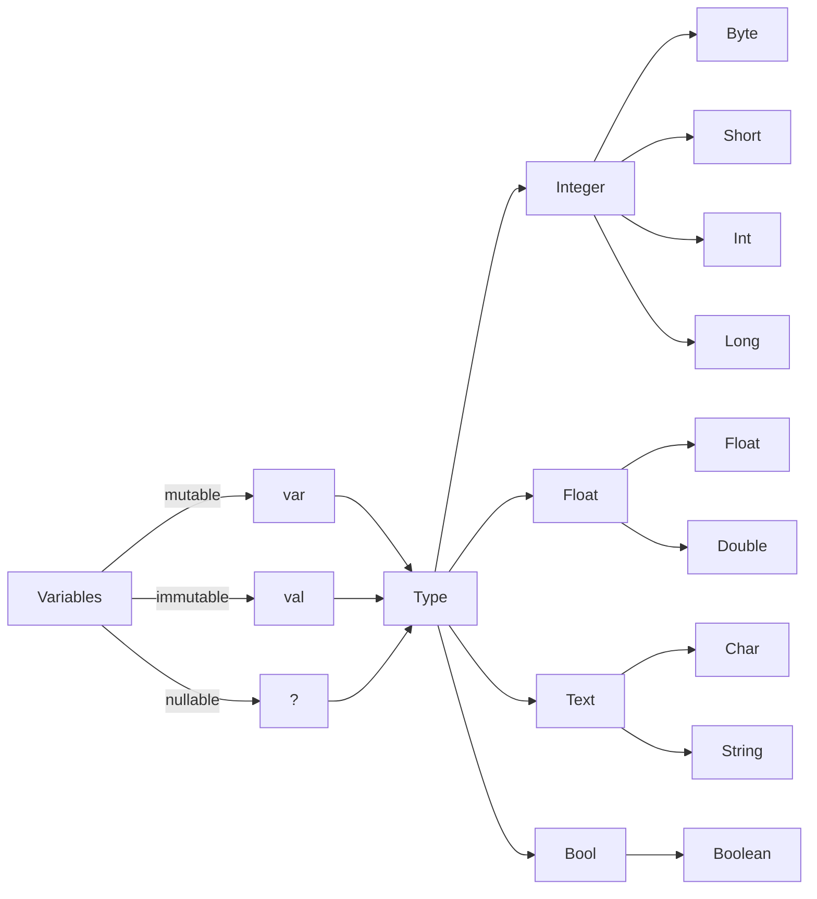

Kotlin is a statically typed language, so the data type of every expression is known at compile time.



## Var and Val
to create a variable in Kotlin you have to use **var** for mutable variable (can be re-assigned) or **val** for immutable (Constant variable).

```kotlin
var number_var = 17
println("number = $number_var") // number = 17

number_var = 18 // you can reassign value
println("number = $number_var") // number = 18


val number_var = 17
println("number = $number_var")

number_var = 18 // Not allowed, throuws an exception
```

> Prefer val to var to simplify data flow and facilitate reasoning about your code.

## Integers
```Kotlin
val byte_var: Byte = 127
val short_var: Short = 32767
val int_var: Int = 2137483647
val long_var: Long = 9223372036854775807
```

## Float
``` Kotlin
val float_var: Float = 3.4028235e38f
val double_var: Double = 1.7976931348623157e308
```
> e denote exponentiation  1e3 == 1x10^3 == 1000
> Float denoted by 'f suffix, otherwise Kotlin infers Double as the type of the number.

## Text
``` Kotlin
val charachter_var: Char = '#'
val text_var: String = "Learning Kotlin"
```

## Booleans
```Kotlin
val yes_var: Boolean = true
val no_var: Boolean = false
```


> Kotlin's basic type map to Java's primitive types when targeting the JVM

Type Inference
It is a compiler feature that allows you to omit types in your code when the compiler can infer it for you, Kotlin's compiler can infer the types of most variables, so adding the type is optional.

> We need to choose to add an explicit type even if the compiler can infer it for:
> - Code readability and clarity
> - To program against an interface instead of an implementation.


## Nullable Types ?
By default Kotlin's types are non-nullable, so you can not assign it to null, the reason for that to make it compatible with the Java's primitive types.

```Kotlin
val input: String = null
// this will generate a compiler error (Can not assign null to non-nullable type)
```

But to make a nullable variable we can use **?** mark at the end of the type

```Kotlin
val input: String? = null
// this will work
```

but if you try to make any operation on the null variable the compiler will not accept it

```Kotlin
val input: String? = null
val output = input.toUpperCase()
// this will generate a compiler error (Unsafe call on nullable object)
```

### Safe Call operator ?.
To access members of a nullable object in Kotlin, you have to append the operator by **?**

```Kotlin
val input: String? = null
val output = input?.toUpperCase()
// this will work and will return null
```

> In nested structures of nullable objects, you need to chain the safe call operator like
> first?.second?.name

### Elvis operator ?:
To define a default value in case of null

```Kotlin
val name: String? = null
val chatName = name ?: "Anonymous" // Elvis operator
val displayName = chatName.toUpperCase() // ANONYMOUS
```

This means that if the name is null assign name to Anonymous
> **Fun fact:** The name “Elvis operator” stems from the fact that it looks like an elvis emoji `?:-O`

You can use Elvis operator to throw an exception or even as if condition

```Kotlin
val input: String? = null
val userInput = input ?: throw IllegealArgumentException("Input must not be null.")
```

### Unsafe Call operator !!
This is the last access you should use because you are telling the compiler that the object you are trying to access can not be null at this particular place in your code, so it will access the variable without further safety check, so if you are wrong, you will get a null pointer exception.

```Kotlin
val input: String? = null
val output = input!!.toUpperCase()
```

# Summary
- In Kotlin types are not nullable by default
- The safe call operator **?** is used to safely access members of nullable types
- The Elvis operator **?:** is used to handle null values (Default values)
- The unsafe call operator **!!** acts like a non-null assertion and should be used wisely.