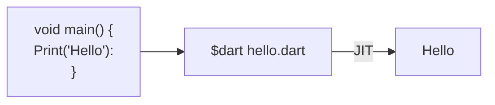

# Install SDK
[Get-dart](https://dart.dev/get-dart)

# IDE
[Dart Pad](https://dartpad.dartlang.org)

# Introduction
Dart is a static type, compiled language, object oriented language 

Dart supports 2 types of compilation:
- AOT ( Ahead Of Time )
- JIT ( Just In Time )




## Synatx

Dart uses C syntax so it uses main function to start the program

```dart
main() {
	var firstName = 'Amr';
	String lastName = 'Tarek';

	print(firstName + ' ' + lastName)
}
```

## Comment
```Dart
// In-line

/*
Block
*/

/// Documentation
```


## Dart Virtual Machine (Dart VM)
Designed to run code quickly and efficiently
Involves 2 phases:
- Compile time
- Runtime
At compile-time, Dart code is checked and optimized, ensuring early error detection and better performance. 

During run-time, the Dart VM executes the compiled code, managing dynamic operations such as memory allocation and user interactions.

## Dart JIT, AOT
Dart uses 2 ways to turn the code into target application
- Ahead of time (AOT)
- Just in time (JIT)

AOT happens before running the program. 
It translates all the Dart code into machine code ahead of time, allowing an app to start faster and run more smoothly.


JIT happens when the program is running. 
It translates the Dart code into machine code, which is the code the computer understands right before it needs to run it. 

JIT is great for development because you can see your changes instantly without restarting the app. 
This process is called hot reload. 


## Dart Garbage Collection
which is used to manage memory. 

Garbage collection automatically cleans up parts of memory that your app no longer needs so you don't have to do it yourself. 

Dart uses a generational garbage collection strategy. 

This strategy divides objects into different generations based on their age. 
- Young
- Old
The young generation objects are temporary or only needed for a short time and then thrown away. 

So garbage collection cleans them up frequently to remove items you no longer need. 

The old generation are objects your app uses more often and for longer periods.

The old generation is cleaned less often because these items are more likely to be used again

## Concurrency

it is used frequently and remains in memory for longer. 

Dart also excels in concurrency, which is about doing multiple things at the same time, Dart handles this with isolates and async programming. 

Isolates are like separate workers that run at the same time without sharing memory. This prevents problems when two things try to use the same memory at once. 

They communicate by sending messages to each other. 
Async programming works by using `async` and `await`. 

These keywords help you write code that does not stop running while waiting for something else to finish, such as loading data from the internet. 
One example of concurrency in Dart includes loading data from the internet. 

Also, Dart uses concurrency when reading files. 

If your app needs to read a large file from the device storage, it can read the file in the background. This prevents the app from freezing while the file is being read, allowing the user to continue using the app smoothly


## Dart Libraries
- dart:core (automatically included in every dart program)
	- Which provide basic functions and classes like number strings and lists.
- dart:async
	- Helps with asynchronous programming which includes class like
		- Future
		- Stream
- dart:io
	- Handles input and output
		- like reading files or connecting to the internet
- dart:convert
	- Helps with converting data like json <-> dart objects
- dart:math


## Sources
[Dart Programming Tutorial - Full Course](https://www.youtube.com/watch?v=Ej_Pcr4uC2Q)
