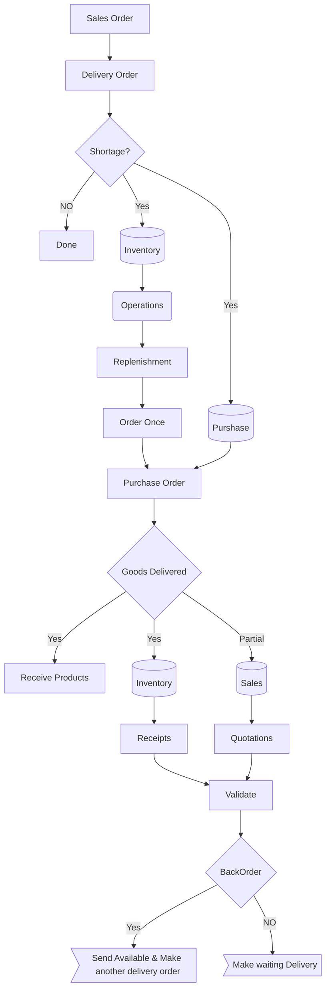

# Odoo Inventory module
Odoo Inventory is both an inventory application and a warehouse management system, key features include product management, replenishment strategies, tracking using lots and serial numbers, inventory adjustments, valuation, and more.

So first of all let's know what does inventory mean.

## Inventory

Inventory refers to the stock of goods, materials, or products that a business holds for the purpose of resale, manufacturing, or consumption.
Odoo Inventory module covering:
- **Product Creation**: Create products with relevant information such as name, description, cost, and quantity on hand.
- **Vendor Management**: Manage vendor information for the products, including contact details and pricing agreements.
- **Purchase Orders**: Create purchase orders to order products from vendors. Link these orders to specific products and vendors.
- **Goods Receipt**: Receive the ordered products into your inventory. Update stock levels accordingly.
- **Quality Checks**: Perform quality checks on received goods to ensure they meet specified standards.
- **Stock Transfers**: Transfer stock between different warehouses or locations within your organization.
- **Inventory Adjustments**: Make manual adjustments to stock levels to account for discrepancies or inventory corrections.
- **Delivery Orders**: Prepare and fulfill customer orders by creating delivery orders.
- **Invoicing**: Generate invoices based on delivered products for billing purposes.
- **Stock Valuation**: Calculate the value of your current stock based on the cost of goods.
- **Reporting and Analysis**: Utilize Odoo's reporting tools to analyze inventory movements, sales, and other relevant data.

## Workflow
The workflow for Odoo Inventory typically involves the following



## Invenroty Operations Types
Depend on your Odoo database you will have:
- **Receipts**: which is a list of that is expected usually according to the **purchase orders** you have entered.
- **Internal Transfers**: which allows you to transfer stock between warehouses it required.
- **Delivery Orders**: This is all orders that need to go out to customers usually triggered from **sales orders**.
- **Returns**: This is where you can put through any returns of goods from a customer.
- **Manufacturing**: Which is the list of open manufacturing orders to move forward with.

### Items status
- **To process**: It will take you to all the items that are ready to be processed now.
- **Waiting**: It means it is waiting for stop whether that's a manufacturing order to process or from purchase order.
- **Late**: it means it is waiting stock but the scheduled date on the order has passed.
- **Back Orders**: If you have a partial shipping turned on so it shows you what you have outstanding where you've already sent out part of the order.

### List all Products
You can use inventory to list all product by selecting **Products** from the menu list and then select **Products** again.
This will show you all the products with the basic data like **Name, Price** and if it is **stockable** type of products then it will also show you **On Hand** quantity.

#### Products List View
In the list view for product you will find more information for each product like the **internal reference, Resposible, Tags, Sales price, Cost, Quantity On Hand, Forcasted Quantity**, and **Unit of Measure**.

##### On Hand Quantity
It is the quantity physically present in your warehouse.

##### Forcasted Quantity
It is the virtual stock, which means the actual quantity available, which is calculated by formula
```md
Forcasted quantatiy = On Hand + Incoming - OutGoing
```

### List Stock
There are two ways to see your current stock you have of the products:
- By Click on the product it self, then (the Magic Button) On Hand.
- From **Reporting** Menu and select **Stock**

### ReOrdering Rules
For ever product you can set a reordering rules, this could be **automatically** triggered or **manually** triggered depends on the **Min**, **Max** values for the product.

To do so you have to open the required product and you woll find a (Magical button) with (Min: value, Max: Value), and when you click it, it will open the **Reordering Rules**

### Replenishment
You can Replenishment (Refill) your stock by selecting **Operations** from the menu list and then select **replenishment**.
In Relplinshment you can select to order once or Automate orders, or Snooze to make a reminder after selected period of time.

## Warehouse
You can configure the warehouses in odoo from Inventory module by selecting **configuration** from the menu list and then select **warehouses**.
You can configure whether to receive or deliver shipments in **one, two,** or **three** steps.
