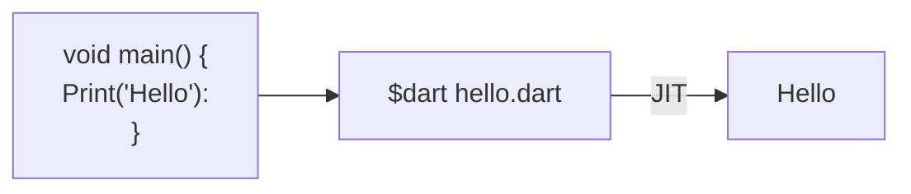

# Install SDK
[Get-dart](https://dart.dev/get-dart)

# IDE
[Dart Pad](https://dartpad.dartlang.org)

# Introduction
Dart is a static type, compiled language, object oriented language 

Dart supports 2 types of compilation:
- AOT ( Ahead Of Time )
- JIT ( Just In Time )




## Synatx

Dart uses C syntax so it uses main function to start the program

```dart
main() {
	var firstName = 'Amr';
	String lastName = 'Tarek';

	print(firstName + ' ' + lastName)
}
```

## Comment
```Dart
// In-line

/*
Block
*/

/// Documentation
```


## Sources
[Dart Programming Tutorial - Full Course](https://www.youtube.com/watch?v=Ej_Pcr4uC2Q)
