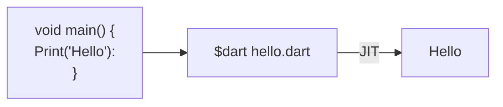

# Install SDK
[Get-dart](https://dart.dev/get-dart)

# IDE
[Dart Pad](https://dartpad.dartlang.org)

# Introduction
Dart is a static type, compiled language, object oriented language 

Dart supports 2 types of compilation:
- AOT ( Ahead Of Time )
- JIT ( Just In Time )




## Synatx

Dart uses C syntax so it uses main function to start the program

```dart
main() {
	var firstName = 'Amr';
	String lastName = 'Tarek';

	print(firstName + ' ' + lastName)
}
```

## Comment
```Dart
// In-line

/*
Block
*/

/// Documentation
```

# Variables
Dart supports static and dynamic type definition,
by default all variables assigned to `null` value

### Data types
- Primitives
	- int
	- double
	- String
	- bool
	- dynamic
- Collection
	- List
	- Set
	- Map
	

Primitives
```dart
int amount1 = 100;
var amount2 = 200;
print('Amount1: $amount1 | Amount2: $amount2 \n');

double damount1 = 100.11;
var damount2 = 200.22;
print('dAmount1: $damount1 | dAmount2: $damount2 \n');

String name1 = 'Amr';
var name2 = 'Tarek';
print('Amount1: $amount1 | Amount2: $amount2 \n');

bool isItTrue1 = true;
var itItTrue2 = false;
print('isItTrue1: $isItTrue1 | itItTrue2: $itItTrue2 \n');

dynamic weakVariable = 100;
print('weakVariable 1 : $weakVariable \n');
weakVariable = 'Dart Programming';
print('weakVariable 2 : $weakVariable \n');
```

Collection
```dart
// List (Arrays), it is a class (It can have mixed types or single types)
// Dynamic type (Mixed)
List data = ['Amr', 'Tarek', 30];
print(data[0]); // Amr
print(data[1]); // Tarek
print(data.length); // 3

List <String> name = ['Amr', 'Tarek']; // only strings are allowed
name[1] = 'hello';
print(namep[1]); // hello

// to make it immutable you can use const keyword
List <String> name = const ['Amr', 'Tarek']; // only strings are allowed
name[1] = 'hello'; // Error

// By default object is copy by refernce
List <String> names = ['Amr', 'Tarek'];
var names2 = names;
print(names2[1]); // Tarek
names[1] = 'test'; // update the original one and the new one will update too.
print(names2[1]); // test

// To copy by value use [...]
var names2 = [...names];


// Set (Uniqe)
var halogens = {'flourine', 'chlorine', 'fluorine'};
print(halogens.length); // 2 (becuse it deletes the duplication)
// HashSet
var halogens = <String>{};
// or 
Set <String> names = {};  // CompactLinkedHashSet<String>

// Map (dictionary)
var gifts = {
	'first': 'Mug',
	'second': 'T-shirt'
};
var gifts = {1:'Mug', 2:'T-shirt'}

var gifts = Map();
gifts['first'] = 'Mango';

```

### Type Conversion
- strings type
	- single quote 
	- double quote
	- row string
	- multiline string
```dart
var s1 = 'test';
var s2 = "test";
var s3 = r'test \n will be printed as it is';
var s4 = ''' multi
line''';
var s5 = """ another multi
line string """;
```

- type conversion
	- You have to use the `parse` method of the type object
```dart
// String -> int
var one = int.parse('1');
assert(one == 1);

// int -> String
String oneString = 1.toString();
assert(oneString == '1');

// String -> double
var oneFloat = double.parse('1.1');
assert(oneFloat == 1.1)

// double -> String
String piString = 3.14159.toStringAsFixed(2);
assert(piString == '3.14');
```

- constant variables
```dart
const aConstNum = 0;
const aConstBool = true;
const aConstString = 'string';
```

### Operators
Mathematical
```dart
// Mathematical
int num = 10 + 22;
num = num % 5; // reminder
// unary
num += 2;
num *= 2;
```

Conditions
```dart
// relational  ==, !=, >=, <=
if (num = 0){
	print("Zero");
}
// Ternart
int x = 100;
var result = x % 2 == 0 ? 'Even' : 'Odd';
print(result); // Even

// is operation
if (x is int){
	print("Integer");
}
```

Logical
```dart
// And &&
// OR ||
// Not !
if (num > 200 && num < 210){
	print("Num is between 200 and 210");
}
```

Null
```dart
// Null Aware operator
// (?.), (??), (??=)

var n;
int number;
number = n?.num; // number will equal null if the n is null
number = n?.num ?? 0; // if the n is null make default value 0
number ??= 100; // assign 100 incase it was null
```

### Flow Control
if
```dart
if (num == 0){
	print("Zero");
} else if (num == 1){
	print("One");
} else {
	print("Unkown")
}
```

Switch Case
```dart
int number = 0;

switch(number) {
	case 0:
		print("zero");
		break;
	case 1:
		print("One");
		break;
	default:
		print("Unknown");
}
```

Loop
There are 5 loop types in dart:
```dart
// standard for loop
for (var i = 1; i <= 10; ++i) {
	print(i); //1,2,3,4,5,6,6,7,8,9,10
}

// for in loop
var numbers = [1,2,3];
for (var n in numbers){
	print(n); //1,2,3
}

// for each loop
// it takes another function as a parameter
void printNum(n){
	print(n)
}
numbers.forEach( printNum ); //1,2,3
numbers.forEach( (n) => print(n) ); //1,2,3


// while loop
int num = 5;
while(num > 0) {
	print(num);
	num -= 1;
}

// do while
do{
	print(num);
	num -= 1;
} while (num >0);
```

### Functions
function is an object of class Function


```dart
//return_type function_name(function_argument){
// body 
//}

void showOutput(var msg){
	print(msg);
}

dynamic square(var number){
	return number * number;
}

// Short formula for function by (arrow function) =>
dynamic square(var number) => number * number;

// Anonymous function (function whithout name) (Lamda)
var list = ['apples', 'bananas'];
list.forEach( (item) {print(item);} ); // forEach takes a function

// There is 2 arguments types
dynamic sum(var num1, var num2) => num1 + num2;
// Positional parameter
print(sum(1,2)); // 3
// Named parameter
print(sum(num2:2, num1:1)); //3


// Optional Parameter by name {}
// it should always called by name
dynamic sum(var num1, {var num2}) => num1 + (num2 ?? 0);
dynamic sum(var num1, {var num2 = 0}) => num1 + num2;
print(sum(1, num2: 2)); // 3
print(sum(1)); // 1

// Optional Parameter by postion []
dynamic sum(var num1, var num2]) => num1 + (num2 ?? 0);
print(sum(1,2)); // 3
print(sum(1)); // 1
```

### Class
The class is a blue print from an object
```dart
class Person {
	String name;
	int age;

	//methods
	void showOutPut() {
		print(name);
		print(age);
	}
}

class MyPerson {
	String name;
	int age;

	// Default Constructor
	MyPerson(String name, [int age = 18]) {
		this.name = name;
		this.age = age;
	}
	// Or 
	// MyPerson(this.name, [this.age = 10]);

	//methods
	void showOutPut() {
		print(name);
		print(age);
	}
}

void main() {
	Person person1 = Person();
	person1.name = 'Amr';
	person1.age = 35;
	person1.showOutPut(); // Amr    35

	var person2 = MyPerson("Amr");
	person2.showOutPut();  // Amr   18
}
```


## Sources
[Dart Programming Tutorial - Full Course](https://www.youtube.com/watch?v=Ej_Pcr4uC2Q)
